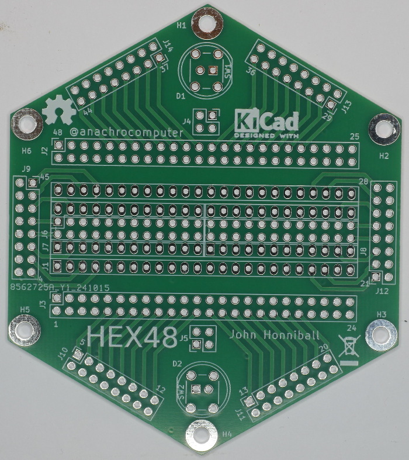

# Hex48 #

PCB design for a hexagonal prototyping board capable of holding DIL chips with
up to 48 pins.

## The Problem ##

Everybody has prototyping PCBs in rectangular form, but what other shapes tesselate well?
How about hexagons, would they work?
And why stop at 40-pin DIL packages when chips like the 68008 come in 48-pin DIL?

## The Solution ##

This PCB design mounts the DIL part on a hexagonal board that can be easily tesselated.
It has mounting holes for M3 PCB standoffs, or it can be fitted with non-slip feet.
In extreme cases, a heavy base can be made out of an insulator such as slate.

## KiCad ##

This design has been created using the Open Source CAD package KiCad, V8.0.

To install it on Ubuntu Linux:

`sudo add-apt-repository ppa:kicad/kicad-8.0-releases`

`sudo apt update`

`sudo apt install kicad`

I'm using Ubuntu 22.04 LTS which would give me the very outdated KiCad V6.0 by default.
As I write this, the latest KiCad is V8.0.5,
which is a big upgrade from the V6.0 which I started with.

## PCB Photo ##
Photo of the PCB, as manufactured.

